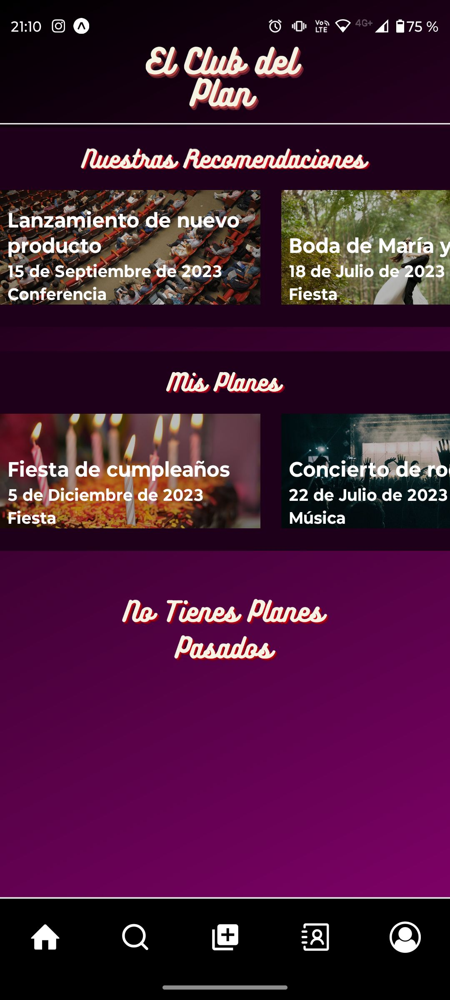
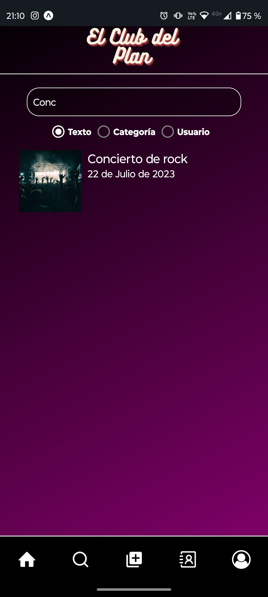
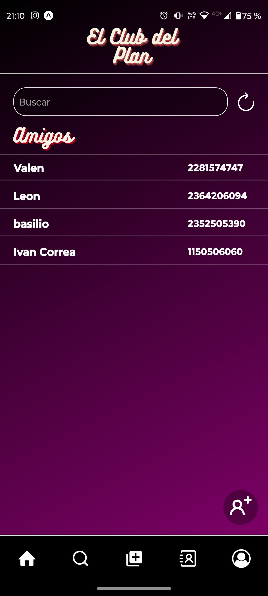

# El-Club-Del-Plan

### DESCRIPCION DEL PROYECTO
El Club Del Plan, Es Un Aplicación que permite administrar, compartir y fondear planes entre contactos. Un plan es un evento social, ir a comer a un restaurante, tomar algo en un bar, ir al cine, al teatro, reservar una mesa en un boliche o un viaje en grupo. En definitiva, lo que un grupo de personas con ganas de hacer algo juntos quieran planear. 

## Stack De Tecnologias Usadas
● Back End: Node.js + Express + MongoDB

● Front End: React Native + Redux 

## Como Se Desarrollo

El Proyecto Se Desarrollo En Equipo De 4 Desarrolladores A Lo Largo De 4 Sprints Organizandonos Con Trello , Tuvimos Deadlines Y Una Demo Semanal  En El Contexto De Una Practica Profesional De 1 Mes Con Ceibo Digital

## Landing Page De La App 
Para acceder a la landing page hacer click [aqui](https://elclubdelplan.netlify.app/)

## Capturas De Las Vistas Del Proyecto

|  |  |  |  |  |  |  |  |  | 

